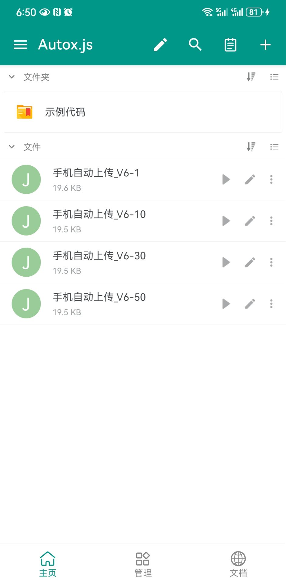

# jdvideopost_app
京东内容助手APP手机视频自动上传AUTO.JS脚本 自动化批量化 ， 京东达人视频上传手机APP自动上传脚本， 华为mate20京东内容助手版本1.7.2测试通过


# 京东内容助手视频发布脚本

## 🚀 工具简介
专为京东达人、电商卖家打造的移动端自动化运营神器，基于Auto.js开发，实现京东内容助手APP的全流程自动化操作。通过模拟人工操作逻辑，批量处理视频上传、商品关联、标签优化等操作，彻底解放双手，让视频发布效率提升100倍以上， 可多手机多帐号多开，注意IP分散，注意视频内容来源站外或站内视频经过伪原创处理后再移至手机中操作。

## 📊 运行示例  
### 手机APP界面   
| AUTOJS脚本 | 京东内容助手|  
|----------|------------|  
|  |  |  
|  |  |  


## 🌟 核心功能亮点

### 🔥 全流程自动化操作
- **视频批量处理**：自动从指定目录读取视频文件，重命名并移动至相册，支持.mp5/.mp4格式
- **智能商品关联**：根据视频文件名提取SKU，自动打开京东APP完成商品加购和关联
- **标题与标签优化**：自动提取视频标题，随机生成体裁标签（Vlog/种草分享/知识科普等）
- **发布状态检测**：实时监控发布结果，自动识别"发布成功"或"上传失败"提示

### ⚡ 高效多账号运营
- **账号池管理**：支持批量导入达人账号，自动轮换使用
- **购物车智能清理**：发布前自动清空购物车，避免商品冲突
- **多线程并发**：可自定义设置发布数量，单批次处理多视频

### 🧠 智能防检测机制
- **模拟人工操作**：随机延时点击、滑动，避免被平台识别为机器人
- **文件系统交互**：自动扫描媒体库，模拟真实用户操作流程
- **无验证码阻碍**：纯模拟操作，不触发平台验证码机制

## 📈 运营效率提升
| 指标         | 人工操作         | 工具操作         | 提升幅度 |
|--------------|------------------|------------------|----------|
| 操作耗时     | 5分钟/条         | 20秒/条          | 90%      |

与电脑PC版达人后台的视频上传功能不同， 因 京东内容助手APP 无验证码环节，手机脚本可做成完全的无人值守， 点开始后，就完全不需要管，不需要看，直接走人外面玩起。。。


## 📌 工作流程示意图


## 🛠️ 核心技术特点
- **Auto.js自动化**：基于Android无障碍服务，实现真实点击滑动操作
- **智能文本处理**：从文件名中提取SKU和标题，支持自定义格式解析
- **多应用协作**：无缝切换京东APP和京东内容助手，保持操作连贯性
- **异常处理机制**：自动处理"无货"、"发布失败"等异常场景

## 📱 适用场景
- **电商卖家**：批量发布商品带货视频，覆盖全品类推广
- **MCN机构**：管理多达人账号，统一内容发布流程
- **自媒体团队**：矩阵号运营，快速测试内容爆款潜力
- **营销公司**：为客户提供一站式视频代运营服务

## 🚦 快速启动指南
1. **环境准备**  
   - 安装Auto.js 4.1.1+
   - 开启手机无障碍服务
   - 确保京东和京东内容助手已安装

2. **参数配置**  
   ```javascript
   var postNum=10 // 发布数量
   var videoDir = files.getSdcardPath() + "/Pictures/1600/"; // 视频存储目录
   var destDir = files.getSdcardPath() + "/Pictures/"; // 相册目标目录
   ```

3. **启动运行**  
   - 将脚本导入Auto.js
   - 授予文件读写权限
   - 点击运行按钮开始自动化发布

## 📝 注意事项
0. **真机测试**：测试使用真实手机华为mate20/ 30/ 20pro，而非模拟器，京东会对很多模拟器有识别
1. **分辨率适配**：默认适配720*1280分辨率，其他分辨率需修改坐标参数
2. **账号安全**：建议使用站内视频时先做伪原创处理，避免账号站内搬运风险
3. **视频格式**：请确保视频为.mp5或.mp4格式，且文件名包含SKU和标题， 已带上 视频批量改名为MP5的批处理文件
4. **平台规则**：请遵守京东内容发布规范，避免违规操作

## 💬 开发者说明
本工具仅用于辅助正常运营，请勿用于违规操作。由于平台规则可能更新，若遇到操作失败请及时更新脚本或联系开发者适配。
VX: LIUMINGDADA


